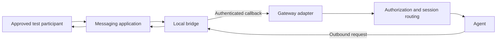

# Local messaging gateway operations

## When to use

Outbound delivery works but inbound replies do not, or a new bridge needs a layer-by-layer acceptance record. An accepted send is not a working two-way integration.

## When not to use

Not for silently installing software, granting OS permissions, exposing a public relay, replaying real messages, weakening security controls or enabling privileged private APIs. This draft does not authorize live messaging.

## Prerequisites

An operator-selected gateway and bridge with documented authentication, an approved test destination/sender, and access to sanitized status surfaces. Generic bridge concepts span platforms; an iMessage/BlueBubbles host requires macOS and its own account/OS prerequisites. No cross-platform live compatibility was tested here.

## Safety boundaries

Read-only: inspect scoped listener/service metadata and sanitized adapter/callback state. Authenticated health reads require explicit credential-use permission and an approved secret-safe client. Registration, setup, restarts, authorization edits and every send are state-changing. Restarting a gateway may deliver queued messages or home-channel notifications; include those effects in approval.

Do not print credential values, full authenticated URLs, request bodies, raw HTTP exceptions or environment dumps. Use supported local secure input; never paste secrets into agent chat. See [credential and evidence guidance](references/credentials-and-evidence.md).

## Workflow

1. Record expected bridge endpoint and callback direction, process ownership, listener scope and service health. Same-host loopback is preferred; a LAN bind is additional exposure, not equivalent to loopback.
2. With separately authorized credentials, verify authenticated API access using status-only output. A listening port is not authentication evidence.
3. Confirm the adapter is enabled and connected; verify exact callback destination, subscriptions and registration count without revealing authentication parameters. Treat stale-row deletion as a separate mutation.
4. After explicit test-send approval, send one harmless unique test to an exact existing conversation and read it back at the destination. Do not resolve a direct message by participant membership alone.
5. Separately observe a fresh authorized inbound reply creating/advancing the intended gateway session. A replay can isolate parsing/dispatch but cannot prove automatic bridge transport; no replay is included here.
6. Verify unauthorized/unauthenticated events cannot invoke the agent. Pairing challenges may be expected but are not authorized agent access; test under separately approved scope and preserve the actual behavior.
7. After restart approval, recheck supervision, authentication, registration, outbound readback, inbound dispatch and authorization. Account for sleep/login state and duplicate callbacks. Report each layer independently.

## Architecture

## Verification checklist

- [ ] Service and listener health observed.
- [ ] Authenticated API access checked without credential output.
- [ ] Adapter connection and callback registration independently checked.
- [ ] Outbound send receipt and exact destination readback both captured.
- [ ] Fresh inbound event automatically dispatched to the intended session.
- [ ] Allowed, denied and unauthenticated behavior verified separately.
- [ ] Approved restart completed and the required layers reverified.
- [ ] Every unknown, failed or unexecuted layer retained; no single “connected” shortcut.

## Synthetic worked example

[Layered verification report](examples/verification-report.md) is a fictional failure-analysis example. All actual operational checks in this pack are not executed.

## Known limitations

Self-originated messages may be ignored. GUI login and wake state can affect sending. Bridge registration does not establish transport, authentication does not establish authorization, and synthetic validation establishes neither. The architecture is illustrative; Mermaid rendering and live integration were not tested. See [attribution](../../ATTRIBUTION.md) and the [MIT License](../../LICENSE).
